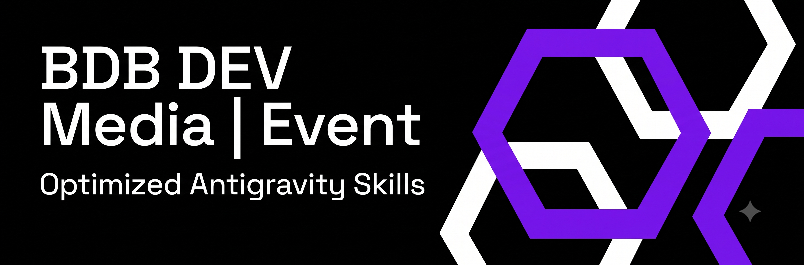

# 🚀 BDB DEV - Optimized Creative & Full-Stack Skills Pack

Welcome to the **BDB DEV Skills & MCP Configuration** repository. This project serves as the backbone of our creative and full-stack development ecosystem, supercharging AI agents with highly specialized capabilities tailored for the event and creative technology industry, as well as general-purpose software engineering.

While optimized for **Google Antigravity**, this skills pack and MCP configuration is **100% universal** and works seamlessly with all modern AI agents and developer interfaces, including **Claude Desktop, Claude Code, Cursor, Aider, Roo Code, Cline, and Windsurf**.

> 🎙 **Audio Deep Dive:** [Listen to the Voice Explanation: "Give AI Agents Control of Creative Software"](assets/Give_AI_Agents_Control_of_Creative_Software.m4a)

---

## 🌟 144 Optimized Skills

We started with a massive pool of over 1,400 raw AI skills. After rigorous testing, filtering, and refinement, we’ve distilled them down to a hyper-curated set of **144 Optimized Skills** (featuring a native OpenWiki documentation engine in v1.3.3, and the **memB local semantic memory brain in v2.0.0**).

These skills are precision-engineered to ensure agents waste no time on redundant tasks and instead operate with maximum agency and context awareness.

### 💻 Beyond Events: Normal Software & App Coding
While heavily optimized for the creative tech industry, these skills are deeply rooted in core software engineering:
- **Full-Stack Development**: Spinning up Next.js App Router boilerplates, building scalable Node.js microservices, and crafting interactive frontends.
- **App Development**: Architecting databases, designing REST APIs, and building standard web and mobile applications from scratch.
- **Design & Quality Assurance**: Auditing UI/UX patterns (utilizing `ui-ux-pro-max`), enforcing clean code principles, and setting up strict CI/CD pipelines.

---

## 🧠 BDBrainstorm: The Ultimate Ideation Engine

Included in this optimized arsenal is our proprietary **BDBrainstorm** skill.

BDBrainstorm combines multi-agent brainstorming, the `/grill-me` slash command, subagent-driven development, and extreme UI/UX design workflows to force a comprehensive, multi-agent ideation process. It stress-tests designs, architectures the systems behind them, and outputs actionable, high-fidelity implementation plans.

---

## 🔌 22 Custom Local MCP Integrations

Rather than relying on skeletal python mocks or broken remote APIs, this repository bundles **22 custom, local MCP wrappers** (in the `mcps/` directory). These are built/warmed automatically and allow your AI assistant to read, write, and execute commands within the industry's leading creative software.

### 🎨 Adobe Creative Cloud (Illustrator, Photoshop, After Effects, Premiere Pro)
We provide a dual-engine architecture optimized for macOS and Windows environments:
- **Direct OS-Native Bridge (`bdb_adobe_mcp`)**: Runs zero-install scripting.
  - **macOS:** Targets application bundle IDs directly (`id "com.adobe.illustrator"`, `id "com.adobe.Photoshop"`, `id "com.adobe.AfterEffects"`) via AppleScript `do javascript` / `DoScript` command streams. This bypasses versioning directories and supports latest apps (e.g. Adobe Illustrator 2026).
  - **Windows:** Automatically queries and instantiates local COM objects (`Illustrator.Application`, `Photoshop.Application`, `AfterFX.Application`) via PowerShell wrapper scripts and executes transient `.jsx` ExtendScript code.
- **Cross-Platform UXP WebSocket Bridge (`bdb_adobe_uxp_mcp`)**: A three-tier WebSocket proxy (Node.js server on port 8080 + native UXP developer plugins) for deep DOM manipulation and persistent WebSocket sessions inside Photoshop and Premiere Pro, running identically on Windows and macOS.


### 🎬 DaVinci Resolve (Triple Coverage)
- **Primary: `bdb_davinci_mcp`**: Works on both the **Free and Studio** versions using a workspace script menu loop. Exposes 162 tools (Timeline, clips, markers, grades, Fusion) and includes local CPU-based AI models (Meta Demucs v4 for voice isolation, faster-whisper for auto-subtitles, and rembg for background removal) so free users get Studio-grade features.
- **Studio: `bdb_davinci_mcp_studio`**: The official Node.js server (wrapping samuelgursky) for advanced direct timeline and project management in Resolve Studio.
- **Fallback: `bdb_davinci_mcp_fallback`**: Hoyt-harness professional python server for Studio scripting.

### 📐 Rhino 3D & Grasshopper (Twin-Engine)
- **Primary: `bdb_rhino_mcp`**: McNeel's official connector (managed via Yak router) for native reading/writing of Rhino geometric layouts.
- **Fallback: `bdb_rhino_mcp_fallback`**: The GOLEM 3D server with 105 tools to dynamically manipulate Rhino 8 assets, execute scripts, and solve Grasshopper definitions.

### 🏗️ Vectorworks
- **Primary: `bdb_vectorworks_mcp`**: Semantic RAG-based search index over VectorScript and Vectorworks API documentation (port 8765) for automated CAD drafting.

### 🎮 Unreal Engine
- **Primary: `bdb_unreal_mcp`**: Connects via the Unreal Engine 5 Web Remote Control API (port 30010) and the `gimmeDG` toolset. Allows the agent to query, spawn actors, edit materials, write Blueprints, and automate level/sequencer manipulation.

### 🧊 Blender (Twin-Engine)
- **Primary: `bdb_blender_mcp`**: BlenderMCP socket integration for scene layout, mesh generation, and viewport controls.
- **Fallback: `bdb_blender_mcp_fallback`**: djeada's python server for managing Blender TCP connections and raw python scripting.

### 🎛️ TouchDesigner (Twin-Engine)
- **Primary: `bdb_touchdesigner_mcp`**: MindDesigner-Bridge (`tdmcp`) on port 9980 to read and write networks via custom `.tox` structures.
- **Fallback: `bdb_touchdesigner_mcp_fallback`**: fallback TCP-based node query and inspector.

### 💡 grandMA3 & Resolume
- **grandMA3**: `bdb_ma3_mcp` sends OSC/UDP command streams directly to your grandMA3 console (port 8000) to automate cues, macros, and patch fixtures.
- **Resolume**: `bdb_resolume_mcp` wraps Arena's REST API (port 8080) to sequence layers, query statuses, and trigger clips.

### 🖥️ OS Control (Dual-Engine)
- **macOS/Linux: `zavora_computer_use`**: Bundled with precompiled native Rust NAPI binary objects (macOS arm64/x64, Linux) to control mouse, keyboard, windows, and apps without runtime compile errors.
- **Windows: `bdb_windows_computer_use`**: Native python-based Win32 / COM / UIAutomation controller with local OCR (Tesseract) support for advanced Windows GUI automation.

### 🧠 Local Semantic Brain (memB)
- **`memb_mcp`**: Exposes standard long-term memory tools (`add_memory`, `search_memory`, `delete_memory`, `list_memories`) using a completely local, offline-first vector engine (powered by a bundled 30MB ONNX model and SQLite).

---

## 📖 11 Specialized System Skills

To make these MCP integrations accessible to AI agents, we provide **11 dedicated system skills** inside the `skills/global_config/` directory. If an AI agent imports this pack, it will immediately read these markdown files to learn the tool signatures, expected arguments, ExtendScript hooks, and common troubleshooting steps for each application:
- [`bdb-unreal-mcp.md`](skills/global_config/bdb-unreal-mcp.md)
- [`bdb-rhino-mcp.md`](skills/global_config/bdb-rhino-mcp.md)
- [`bdb-davinci-mcp.md`](skills/global_config/bdb-davinci-mcp.md)
- [`bdb-blender-mcp.md`](skills/global_config/bdb-blender-mcp.md)
- [`bdb-after-effects-mcp.md`](skills/global_config/bdb-after-effects-mcp.md)
- [`bdb-vectorworks-mcp.md`](skills/global_config/bdb-vectorworks-mcp.md)
- [`bdb-touchdesigner-mcp.md`](skills/global_config/bdb-touchdesigner-mcp.md)
- [`bdb-computer-use-mcp.md`](skills/global_config/bdb-computer-use-mcp.md)
- [`bdb-grandma3-mcp.md`](skills/global_config/bdb-grandma3-mcp.md)
- [`bdb-resolume-mcp.md`](skills/global_config/bdb-resolume-mcp.md)
- [`bdb-adobe-suite-mcp.md`](skills/global_config/bdb-adobe-suite-mcp.md)
- [`bdb-memb-mcp.md`](skills/global_config/bdb-memb-mcp.md)
- [`openwiki-skill`](skills/global_config/openwiki-skill/SKILL.md): Direct Gemini-native integration of OpenWiki for autonomous, high-agency documentation management and release notes maintenance.
- [`memb-skill`](skills/global_config/memb-skill/SKILL.md): BDB local-first long-term memory engine (memB). Query, remember, and adapt preferences, code architectures, and developer patterns across tasks.

---

## 📖 OpenWiki Native System

BDB OS v1.3.3 introduces a fully **Gemini-Native OpenWiki** engine designed to autonomously maintain codebase wikis, README entries, and release notes across all your active projects.

### 🧠 How It Works
1. **No Node CLI Overhead:** Rather than utilizing an external Javascript engine and model API keys, the system runs inside your local Antigravity environment, leveraging the 1M+ context window of **Gemini 3.5 Flash** for free.
2. **Git Evidence Loop:** The daemon executes a sub-second Python helper ([openwiki_helper.py](skills/global_config/openwiki-skill/scripts/openwiki_helper.py)) to parse Git changes and unstaged diffs.
3. **Smart Updates:** If code changes are detected, it invokes the global `agy` CLI client in print-mode to update `.openwiki/` markdown pages and root entrypoints, then commits documentation updates separately using the prefix `docs(wiki): update project specs [auto]`.

### ⚙️ Setting Up the Background Daemon
To ensure your project documentation never goes out of date, configure the background daemon:

#### On macOS (LaunchAgent)
1. **Deploy LaunchAgent:** Run the helper installer script:
   ```bash
   bash ~/.gemini/config/skills/openwiki-skill/scripts/install_daemon.sh
   ```

#### On Windows (Task Scheduler)
1. **Deploy Task Scheduler Task:** Run the PowerShell helper script in an Administrator console:
   ```powershell
   powershell -ExecutionPolicy Bypass -File "$env:USERPROFILE\.gemini\config\skills\openwiki-skill\scripts\install_daemon.ps1"
   ```

#### For All Platforms: Register Projects & Monitor
1. **Register Projects:** Add absolute directory paths to your projects config file at `~/.openwiki/projects.json`:
   ```json
   {
     "projects": [
       "/Users/<your-username>/bdb-dev-optimized-antigravity-skills",
       "/Users/<your-username>/Web-Projects/your-project"
     ],
     "interval_seconds": 3600
   }
   ```
2. **Monitor Execution:** Tail the active logs to see background scan actions and documentation rebuild status:
   ```bash
    tail -f ~/.openwiki/daemon.log
    ```

---

## 🧠 memB: Custom Semantic Brain (v2.0.0)

BDB OS v2.0.0 introduces a fully integrated local, offline-first semantic memory brain based on **memB**. 

### ⚙️ Specifications & Capabilities
1. **Dynamic Flower Graph Layout:** Rather than utilizing hardcoded scopes, `memB` structures your memory into a flower-like layout:
   * **General Knowledge Hub (`category="godmode"`):** Stores universal preferences and developer specifications globally.
   * **Dynamic Project Leaves (`project_id="<current-directory-basename>"`):** The system dynamically resolves the active workspace directory name to segment and fetch project-specific learnings, preventing context pollution.
2. **Offline Vector Embeddings:** Bundles a pre-quantized 30MB `all-MiniLM-L6-v2` ONNX model and tokenizer. Vector calculations run locally in milliseconds.
3. **Data Sovereignty (Zero Telemetry):** Designed from the ground up to ensure absolute data sovereignty, with no remote logging, tracking, or analytics endpoints present in the codebase.
4. **Secret Filtration:** Blocks or redacts passwords, raw API keys, and connection strings prior to database injection.

---

## 🛠️ Installation

### 🆚 Which Version Should I Use?
- **Pro Version (`bdb-antigravity-skills-pro`)**: Includes all 144 optimized skills, the interactive MCP selection UI, and **active background daemons**. It automatically installs and orchestrates the `memB` local semantic memory engine and the `OpenWiki` self-documenting git-hooks. Best for fully autonomous, long-term project management.
- **Legacy Version (`bdb-antigravity-skills@legacy`)**: The lightweight v1.x pack. It contains the core skills and standard local MCPs, but **does not** include any persistent background processes, automated wiki generation, or semantic memory. Best for strict, stateless environments where no background daemons are desired.

The installer is built using an interactive Node-based menu. It allows you to:
1. **Backup & Overwrite**: Safely backups existing configuration files and overrides them.
2. **Merge**: Merges the new skills, configs, and custom local MCP paths with your existing ones.

### Option 1: Ask Your AI Agent (Easiest)
Simply tell your assistant:
> "Please run `npx -y @hybridlabor-api/bdb-antigravity-skills-pro` to install the skills pack and configure the local MCP servers."

### Option 2: Command Line (Global via NPX)
Run the script globally in your terminal:

**For the latest v2 with OpenWiki and memB:**
```bash
npx -y @hybridlabor-api/bdb-antigravity-skills-pro
```

**For the legacy v1 (no background daemons):**
```bash
npx -y @hybridlabor-api/bdb-antigravity-skills@legacy
```

### Option 3: Using Homebrew (macOS)
If you are on a Mac and prefer Homebrew, you can tap and install the package:
```bash
brew tap hybridlabor-api/bdb-skills
brew install bdb-skills
bdb-skills
```

### Option 4: Manual Shell Script (Git Clone)
Clone the repository and run the installer script:
```bash
git clone https://github.com/hybridlabor-api/bdb-dev-optimized-antigravity-skills.git
cd bdb-dev-optimized-antigravity-skills
chmod +x installer.sh
./installer.sh
```

**The installer script will automatically:**
1. Back up your existing global and workspace skills safely.
2. Deploy the new curated global config skills.
3. Install the workspace-specific agent skills.
4. Copy the customized `GEMINI.md` to `~/.gemini/GEMINI.md`.
5. Pre-warm Python dependencies via `uv run` to prevent AI agent timeouts on first run.

---
*Elevate your agency. Dominate the workflow.*
