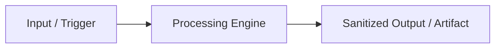

# GitHub Repo Skill: Public-Grade Repository Standards & Release Workflows

The **`github-repo`** skill establishes strict standards for building, organizing, sanitizing, and maintaining production-ready GitHub repositories. It serves as a sister skill to **`openwiki-skill`**: while `openwiki-skill` manages deep wiki documentation in `.openwiki/` and continuous updates, `github-repo` governs repository layout, top-tier README design, CI/CD pipelines, NPM release workflows, and strict privacy/security audits.

---

## 1. When to Invoke This Skill

- **Repository Initialization**: When creating a new repository or preparing an existing codebase for open-source publication.
- **Pre-Push Sanitization Audit**: Before committing or pushing code, to ensure no absolute local paths, API keys, foreign repository names, or cloned user metadata are published.
- **Workflow Setup**: Setting up automated testing (`ci.yml`), automated NPM releases (`publish.yml`), or `.gitignore` rules.
- **README Overhaul**: Restructuring a project's `README.md` to conform to modern open-source standards.

---

## 1.1 ⚡ Mandatory Prerequisite: Automatic OpenWiki Check

Whenever the `github-repo` skill is invoked, the agent MUST perform an automated pre-flight check:

1. **Check `.openwiki/` Existence**: Verify if `.openwiki/` directory exists and contains `quickstart.md`, `architecture.md`, and release notes.
2. **Automatic Execution of `openwiki-skill`**: If `.openwiki/` is missing, empty, or stale, **automatically invoke `openwiki-skill` first** before performing repo structure or README edits.
3. **Handshake**: Allow `openwiki-skill` to scan the codebase and populate `.openwiki/`, then resume `github-repo` tasks (README layout, dynamic badges, CI/CD workflows, sanitization audit).

---

## 2. 🔒 Mandatory Sanitization & Privacy Rules (Clean-Repo Engine)

Before pushing any commit to GitHub, execute this 5-point sanitization audit:

### Rule 1: No Absolute Local Paths or Usernames
- **Forbidden:** Paths like `/Users/john/projects/...`, `C:\Users\dev\...`, `/home/ubuntu/...`.
- **Allowed:** Relative paths (`./src/index.ts`, `config/settings.json`) or environment placeholders (`~/.config/`, `$HOME/`).

### Rule 2: Zero Secrets & Credentials
- **Forbidden:** API keys, secret tokens, private keys, database strings with passwords, OAuth client secrets.
- **Action:** Ensure `.env` is listed in `.gitignore`. Always provide a sanitized `.env.example` file.

### Rule 3: Scrub Foreign Clone Artifacts
- **Forbidden:** Foreign `git remote` URLs, mismatched repository names in `package.json` / `pyproject.toml`, or author details retained from cloned starter templates.
- **Action:** Verify `package.json` fields (`name`, `repository`, `homepage`, `bugs`, `author`) match the target repository explicitly.

### Rule 4: Clean Remote & Repository Name Synchronization
- **Forbidden:** References to older repository names or external GitHub orgs/users that do not match the current project.
- **Action:** Check all internal markdown links, badge URLs, and package references to ensure accurate naming across all files.

### Rule 5: Workspace Artifact Exclusion
- **Forbidden:** Committing `.DS_Store`, build outputs (`dist/`, `build/`), `node_modules/`, scratch files, or environment configurations.
- **Action:** Verify complete coverage in `.gitignore`.

---

## 3. Recommended Repository Layout

```
.
├── .github/
│   └── workflows/
│       ├── ci.yml            # Continuous integration & test matrix
│       └── publish.yml       # NPM publish on GitHub Release tag
├── .openwiki/                # Managed by openwiki-skill (architecture, quickstart, etc.)
│   ├── quickstart.md
│   ├── architecture.md
│   └── release_notes.md
├── src/                      # Source code
├── tests/                    # Unit and integration tests
├── .env.example              # Sanitized environment template
├── .gitignore                # Production gitignore rules
├── CHANGELOG.md              # Version change history
├── LICENSE                   # Open-source license (MIT/Apache-2.0)
├── README.md                 # Primary entrypoint (High-Impact layout)
└── package.json / Cargo.toml # Package manifest
```

---

## 4. High-Impact README Layout Standard & Dynamic Badges

A top-tier `README.md` MUST include a clean row of dynamic shields/badges directly under the main title. Badges MUST be tailored to the specific repository owner, repository name, tech stack, license, test coverage, and key project metric.

### Standard Badge Row Formula
```markdown
# Project Name

[](https://github.com/<owner>/<repo>/actions)
[](https://github.com/<owner>/<repo>)
[](https://github.com/<owner>/<repo>)
[](LICENSE)
[](https://github.com/<owner>/<repo>)

> **High-impact tagline explaining what the project does in 1-2 concise sentences.**
```

### Dynamic Badge Adaptation Guidelines
- **`CI Status Badge`**: Points to `.github/workflows/ci.yml` in the specific repository (`CI | passing`).
- **`Coverage Badge`**: Reflects actual test suite coverage (e.g. `coverage | 94%`).
- **`Runtime / Language Badge`**: Matches the primary runtime (e.g., `python | 3.10+`, `node | 18+`, `go | 1.22+`).
- **`License Badge`**: Matches the project's `LICENSE` file (`license | Apache 2.0`, `license | MIT`).
- **`Key Metric Badge`**: Highlights the primary value or performance metric (e.g. `avg savings | 67%`, `downloads | 10k+`).

---

### 🌐 Multi-Language README Standard (Trilingual Switcher)

When preparing repositories for international audiences, provide multi-language READMEs with a top-bar language navigation switcher placed directly under the header banner:

1. **File Naming Standards**:
   - `README.md` (Default English - GitHub root entrypoint)
   - `README.de.md` (Deutsch / German)
   - `README.pt.md` (Português / Portuguese)

2. **Top-Bar Language Switcher Syntax**:
   - **In `README.md` (English)**:
     ```markdown
     🌐 **Language / Sprache / Idioma**: **English** | [ 🇩🇪 Deutsch ](README.de.md) | [ 🇵🇹 Português ](README.pt.md)
     ```
   - **In `README.de.md` (Deutsch)**:
     ```markdown
     🌐 **Sprache / Language / Idioma**: [ 🇬🇧 English ](README.md) | **Deutsch** | [ 🇵🇹 Português ](README.pt.md)
     ```
   - **In `README.pt.md` (Português)**:
     ```markdown
     🌐 **Idioma / Language / Sprache**: [ 🇬🇧 English ](README.md) | [ 🇩🇪 Deutsch ](README.de.md) | **Português**
     ```

3. **Parity Requirement**: All language versions MUST maintain 100% section parity (Header, Badges, Features, Architecture diagrams, Quickstart commands, CLI reference, License).

---

## ✨ Features

- **Key Feature 1**: Brief description emphasizing benefits.
- **Key Feature 2**: Brief description emphasizing performance or ease of use.
- **Key Feature 3**: Security, privacy, or integration highlight.

---

## 🏗️ Architecture & Workflow



---

## 🚀 Quickstart

### Prerequisites
- Node.js 18+ / Python 3.10+
- Package manager (`npm`, `pnpm`, or `bun`)

### Installation

```bash
# Via NPX
npx <package-name>@latest

# Or global installation
npm install -g <package-name>
```

---

## ⚙️ Configuration

Copy `.env.example` to `.env` and configure environment variables:

| Variable | Description | Default | Required |
| :--- | :--- | :--- | :--- |
| `API_KEY` | Authentication key for external service | N/A | Yes |
| `LOG_LEVEL` | Logging verbosity (`info`, `debug`, `error`) | `info` | No |

---

## 💻 CLI & Usage

```bash
# Run main command
<command-name> --help

# Example command with arguments
<command-name> run --config ./config.json
```

---

## 🔄 CI/CD & Workflows

This repository includes automated workflows for testing and deployment:
- **CI Matrix**: Runs on every push/PR across Node versions (`.github/workflows/ci.yml`).
- **NPM Publish**: Automatically builds and publishes to NPM upon creating a GitHub Release (`.github/workflows/publish.yml`).

---

## 📚 Documentation

For complete architectural details, developer guides, and release notes, visit the [.openwiki/](.openwiki/quickstart.md) directory.

---

## 📄 License

[MIT](LICENSE) © Project Contributors
```

---

## 5. Workflow Templates

### 5.1 `.github/workflows/ci.yml`
```yaml
name: CI

on:
  push:
    branches: [ main, master ]
  pull_request:
    branches: [ main, master ]

jobs:
  test:
    name: Build & Test
    runs-on: ubuntu-latest

    strategy:
      matrix:
        node-version: [18.x, 20.x, 22.x]

    steps:
      - name: Checkout repository
        uses: actions/checkout@v4

      - name: Setup Node.js ${{ matrix.node-version }}
        uses: actions/setup-node@v4
        with:
          node-version: ${{ matrix.node-version }}
          cache: 'npm'

      - name: Install dependencies
        run: npm ci

      - name: Check code formatting & lint
        run: npm run lint --if-present

      - name: Run test suite
        run: npm test --if-present

      - name: Build production package
        run: npm run build --if-present
```

### 5.2 `.github/workflows/publish.yml`
```yaml
name: Publish Package

on:
  release:
    types: [published]

jobs:
  publish:
    name: Publish to NPM
    runs-on: ubuntu-latest
    steps:
      - name: Checkout repository
        uses: actions/checkout@v4

      - name: Setup Node.js
        uses: actions/setup-node@v4
        with:
          node-version: '20.x'
          registry-url: 'https://registry.npmjs.org'

      - name: Install dependencies
        run: npm ci

      - name: Build package
        run: npm run build --if-present

      - name: Publish to NPM
        run: npm publish --access public
        env:
          NODE_AUTH_TOKEN: ${{ secrets.NPM_TOKEN }}
```

---

## 6. Pre-Publish Verification Checklist

Before releasing a package or pushing a release tag:

1. [ ] **Dry Run NPM Build**: Run `npm pack --dry-run` to confirm only intended files are packaged.
2. [ ] **Sanitization Sweep**: Search codebase for any stray `/Users/` or secret strings.
3. [ ] **Version Bump**: Ensure `package.json` version matches `CHANGELOG.md` and release tags.
4. [ ] **Secrets Verification**: Ensure `NPM_TOKEN` is configured in GitHub Repository Secrets.
5. [ ] **OpenWiki Sync**: Run `openwiki-skill` workflow to update `.openwiki/release_notes.md` and root entrypoints.
